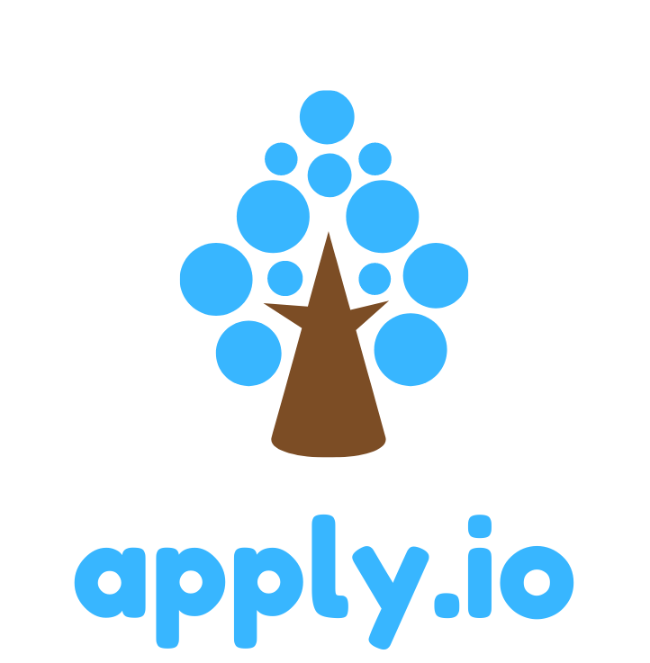

[](https://creativecommons.org/licenses/by-nc-nd/4.0/)




# Apply.io
LinkedIn Automated Application


## Getting started
These instructions will get you a copy of the project up and running on your local machine for development and testing purposes.

## Prerequisites
1. Install selenium.
```bash
pip install selenium
```
2. Install flask
```bash
pip install flask
```
3. Install web_driver
```bash
pip install web_driver
```

## Running The App

```bash
set FLASK_APP=app.py

flask run
```
## Results
The program automatically applies to jobs on LinkedIn based on the user's credentials and preferences.


